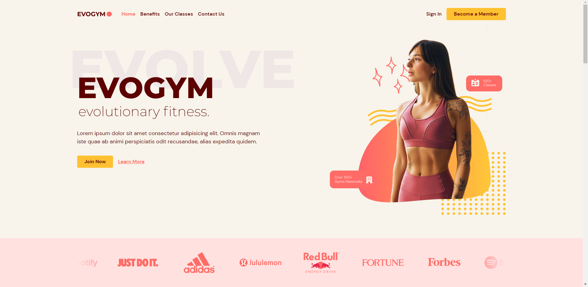

<p align="center">
  
</p>

<p align="center">
  <a href="LICENSE"></a>
</p>



## 💻 Projeto

Landing page da academia Evogym.

[Acesse a aplicação online](https://technotes-sy.netlify.app/)

## 🧪 Tecnologias

- [TypeScript](https://www.typescriptlang.org/)
- [React](https://reactjs.org/)
- [React Hook Form](https://react-hook-form.com/)
- [Framer Motion](https://www.framer.com/motion/)
- [SASS](https://sass-lang.com/)

## 🚀 Como executar

```bash
# Clone este repositório
$ git clone https://github.com/jhonathanalencar/evogym.git

# Entre na pasta
$ cd evogym

# Instale as dependências
$ npm install

# Execute a aplicação em modo de desenvolvimento
$ npm run dev

# A aplicação inciará na porta:5173
acesse <http://localhost:5173>
```
## 📝 Licença

Esse projeto está sob a licença MIT. Veja o arquivo [LICENSE](LICENSE) para mais detalhes.

---

<p align="center">
  Feito com ❤️ por Jh
</p>
